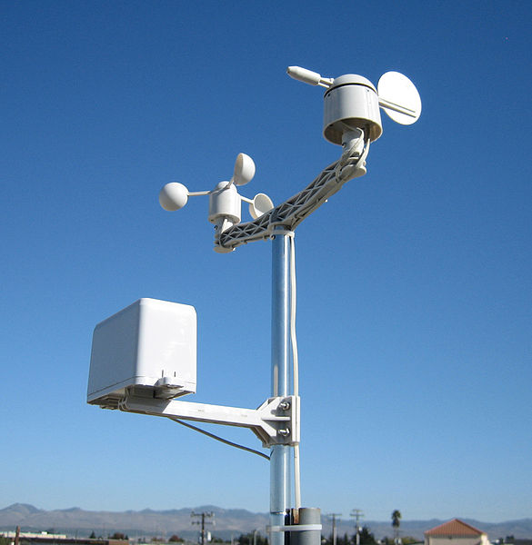
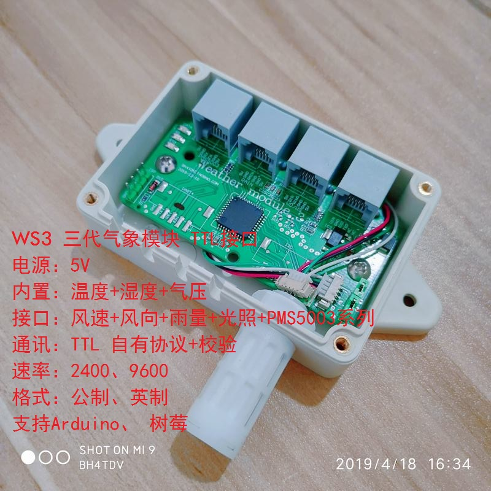

I was curious about how precise the "local" weather forecasts are and ended up ordering a cheap weather station "kit" from Ali Express so I could compare my measurements with the measurements that come from various "hyper local" weather forecast services.

When deployed, it's supposed to look something like this:

Each of the sensors plugs into a controller board that looks like this:

Eventually, a box of sensors and a controller board arrived in the mail. There was no included documentation and what little additional documentation that I have found online since ordering and deploying the station has been collected and added to the [`docs`](./docs) folder. Small tweaks to the code included in this repo based on what i've learned from the documentation.

Each of the sensors is quite simple, but w/o any documentation, it's impossible to know how much rain fall each pulse from the rain fall sensor equates to... etc.

I didn't want to spend much time trying to reverse engineer the sensors or figure out how to drive them, so I spent most of my time trying to work *with* the bundled controller. I did get some decipherable documentation via google translate and, after a bit of trial and error, managed to get a PoC Arduino sketch that could decode the packets. After a bit more work, the Arduino code was ported over to the ESPHome platform. That's what's included here.

C/C++ is not my preferred language, so the code "works" but could probably be optimized in quite a few ways. Pull Requests are accepted!

## Adding support for Particulate Sensors

A more detailed writeup and a basic 3d printable enclosure for outdoor deployments is written up [here](//TODO:link).

In short, the WS3 supports a specific [particulate matter sensor](//TODO:Link). Making a cable to interface the sensor with the WS3 module isn't too much . I've added support for this sensor and updated the code.

Just set the `SUPPORT_PM25_SENSOR` to `1` and run `esphome your_file.yaml run --upload-port ...` to build and upload a new FW version.

While hacking on the additional support, these existing repos were helpful in figuring out which bytes from the PM2.5 was sending me:

- https://github.com/rpanfili/airQualityMeter
- https://github.com/i3water/Blinker_PMSX003ST/blob/master/src/BLINKER_PMSX003ST.cpp

The [datasheet](docs/PMS5003ST_Datasheet.pdf) has been included for reference.
